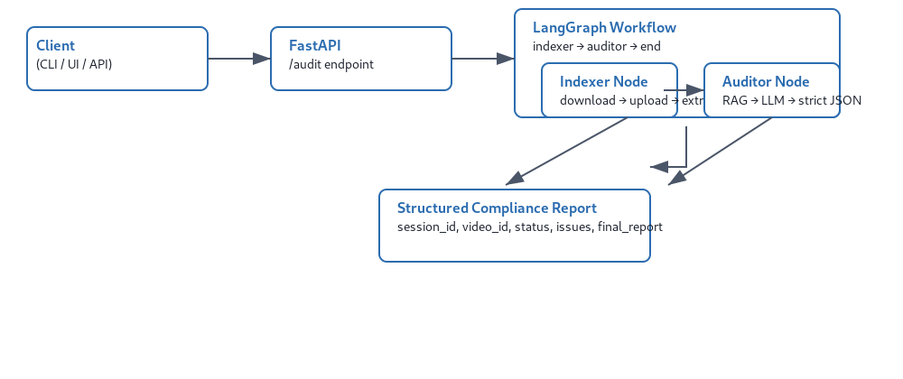

# Video Audit AI – Enterprise Compliance Audit Platform

Video Audit AI is an intelligent, end‑to‑end platform that automatically audits video content (e.g., YouTube videos) against brand safety and regulatory rules. It combines Azure AI services, a vector knowledge base, and a LangGraph‑powered workflow to detect compliance violations in spoken and on‑screen content.

---

## ✨ Features

- **YouTube ingestion** – Downloads videos using `yt‑dlp` and uploads them to Azure Video Indexer.
- **Multimodal extraction** – Extracts speech‑to‑text transcripts and on‑screen text (OCR) via Video Indexer.
- **Retrieval‑Augmented Generation (RAG)** – Queries a vectorized knowledge base of brand rules (stored in Azure AI Search) to retrieve relevant guidelines.
- **LLM‑powered auditing** – Uses Azure OpenAI (GPT‑4) to analyse content against retrieved rules and return structured compliance results.
- **REST API** – FastAPI server with auto‑generated documentation (`/docs`).
- **Observability** – Integrated with Azure Monitor (Application Insights) for metrics, logs, and traces; LangSmith for LLM tracing.
- **Modular, graph‑based workflow** – Built with LangGraph, making it easy to extend (e.g., add human‑in‑the‑loop steps).

---

## 🧱 Architecture Overview

## Architecture




The system is composed of three main layers:

### 1. **Ingestion & Indexing** (one‑time setup)
- **Knowledge Base Builder** – `index_documents.py` reads PDF rulebooks, splits them into chunks, generates embeddings (Azure OpenAI `text‑embedding‑3‑small`), and stores them in an **Azure AI Search** index.

### 2. **Orchestration Layer** (LangGraph workflow)
- **State** – A shared `VideoAuditState` object carries data through the workflow (video URL, transcript, OCR, compliance results, errors, etc.).
- **Nodes**:
  - **Indexer Node** – Downloads a YouTube video, uploads to Azure Video Indexer, waits for processing, and extracts transcript + OCR.
  - **Auditor Node** – Performs RAG:  
    1. Combines transcript + OCR into a query.  
    2. Retrieves top‑k relevant rule chunks from Azure AI Search.  
    3. Calls Azure OpenAI (GPT‑4) with a strict JSON prompt to identify violations.  
    4. Parses and returns results.

### 3. **Serving Layer** (API / CLI)
- **CLI** – `main.py` simulates a full audit from the command line.
- **REST API** – `server.py` exposes a POST `/audit` endpoint, uses the same compiled graph, and returns a structured `AuditResponse`.

All telemetry is automatically collected by **Azure Monitor** (via OpenTelemetry) and **LangSmith**.

---

## 📋 Prerequisites

- An **Azure subscription** with permissions to create resources.
- Python 3.10+ and `uv` (or `pip`).
- (Optional) A **LangSmith** account for LLM tracing.

---

## 🔧 Setting Up Azure Resources & API Keys

Follow these steps to provision all required Azure services and obtain the necessary credentials. After creation, you’ll populate the `.env` file.

### 1. Azure OpenAI
- Create an **Azure OpenAI** resource in the [Azure Portal](https://portal.azure.com).
- Deploy two models:
  - **Chat model** – e.g., `gpt-4o` (deployment name: `gpt-4o`).
  - **Embeddings model** – `text‑embedding‑3‑small` (deployment name: `text‑embedding‑3‑small`).
- After deployment, note:
  - **Endpoint** – `https://<your-resource-name>.openai.azure.com/`
  - **API key** – from "Keys and Endpoint" blade.

### 2. Azure AI Search
- Create an **Azure AI Search** resource (any tier, but Basic or higher recommended for vectors).
- Under "Settings" > "Keys", copy the **primary admin key**.
- Note the **endpoint** – `https://<your-service-name>.search.windows.net`.

### 3. Azure Video Indexer
- Create a **Video Indexer** account (classic or ARM‑based).  
  > *Note:* If you use the ARM version, you also need the subscription ID and resource group.
- In the Video Indexer portal (or via ARM), note:
  - **Account ID** – can be found in the account settings.
  - **Location** – e.g., `eastus`.
  - If using ARM, also note:
    - **Subscription ID**
    - **Resource Group** name
    - **Resource name** (the name you gave the Video Indexer account)

### 4. Azure Storage (optional, for future extensions)
- Create a **Storage Account** (general purpose v2).
- Under "Access keys", copy a **connection string**. (Currently unused but kept for future expansion.)

### 5. Application Insights (Telemetry)
- In the Azure Portal, create an **Application Insights** resource.
- Copy the **instrumentation key** (or the full connection string) from the "Overview" blade.

### 6. LangSmith (LLM Tracing)
- Sign up at [smith.langchain.com](https://smith.langchain.com).
- Create a project (e.g., `video-audit-ai`).
- Generate an **API key** in the settings page.

---

## ⚙️ Environment Configuration

1. Clone the repository:
   ```bash
   git clone https://github.com/duyilemi/video_audit_ai.git
   cd video_audit_ai
   ```

2. Create a `.env` file in the project root and fill in all values using the template below:

   ```env
   # Azure Storage (optional)
   AZURE_STORAGE_CONNECTION_STRING="your-storage-connection-string"

   # Azure OpenAI
   AZURE_OPENAI_API_KEY="your-openai-key"
   AZURE_OPENAI_ENDPOINT="https://<your-resource>.openai.azure.com/"
   AZURE_OPENAI_API_VERSION="2024-12-01-preview"
   AZURE_OPENAI_CHAT_DEPLOYMENT="gpt-4o"
   AZURE_OPENAI_EMBEDDING_DEPLOYMENT="text-embedding-3-small"

   # Azure AI Search
   AZURE_SEARCH_ENDPOINT="https://<your-search>.search.windows.net"
   AZURE_SEARCH_API_KEY="your-search-admin-key"
   AZURE_SEARCH_INDEX_NAME="brand-compliance-rules"

   # Azure Video Indexer
   AZURE_VI_NAME="brand-yt-project-001"                # Your VI account name
   AZURE_VI_LOCATION="eastus"                           # e.g., eastus
   AZURE_VI_ACCOUNT_ID="your-vi-account-id"
   AZURE_SUBSCRIPTION_ID="your-azure-subscription-id"   # For ARM auth
   AZURE_RESOURCE_GROUP="your-resource-group"

   # Application Insights
   APPLICATIONINSIGHTS_CONNECTION_STRING="InstrumentationKey=xxx;IngestionEndpoint=..."

   # LangSmith
   LANGCHAIN_TRACING_V2=true
   LANGCHAIN_ENDPOINT="https://api.smith.langchain.com"
   LANGCHAIN_API_KEY="your-langsmith-key"
   LANGCHAIN_PROJECT="brand-guardian-prod"
   ```

---

## 🚀 Running the Project

### Install dependencies
We recommend using `uv` for fast dependency management:
```bash
uv venv

uv add -r requirements.txt
```

### 1. Index the knowledge base (one‑time)
Place your brand rule PDFs in `backend/data/` and run:
```bash
uv run python backend/scripts/index_documents.py
```
This will chunk the PDFs, generate embeddings, and upload them to your Azure AI Search index.

### 2. Test with the CLI
```bash
uv run python main.py
```
You should see the workflow execute and print a compliance report.

### 3. Start the API server
```bash
uv run uvicorn backend.src.api.server:app --reload
```
- Interactive API docs: [http://localhost:8000/docs](http://localhost:8000/docs)
- Health check: [http://localhost:8000/health](http://localhost:8000/health)
- POST `/audit` with a JSON body:
  ```json
  { "video_url": "https://youtu.be/..." }
  ```

---

## 📈 Production Improvements

While the current implementation demonstrates the core concepts, an enterprise‑grade deployment would require additional considerations:

### 🔒 Security & Compliance
- **Managed Identity** – Replace API keys with Azure Managed Identities for all Azure services (no secrets in `.env`).
- **Secrets Management** – Use Azure Key Vault to store and rotate secrets.
- **Network Isolation** – Place all Azure resources inside a VNet, with private endpoints where possible.
- **Data Residency** – Ensure all services are deployed in the required geographic region.

### ⚡ Scalability & Performance
- **Async Processing** – Use `ainvoke()` with `asyncio` to handle multiple concurrent audits without blocking.
- **Queue‑Based Ingestion** – Offload video processing to Azure Queue Storage or Service Bus; have a separate worker process polling for new jobs.
- **Caching** – Cache frequently retrieved rule chunks in Redis (Azure Cache for Redis) to reduce search latency.
- **Auto‑scaling** – Configure the API server (e.g., on Azure Container Apps or AKS) to scale based on request load.

### 🛡️ Reliability & Error Handling
- **Retry Policies** – Implement exponential backoff for transient failures (Azure OpenAI rate limits, Search throttling).
- **Dead Letter Queue** – For videos that repeatedly fail processing, send them to a dead‑letter queue for manual inspection.
- **Graceful Degradation** – If the LLM is unavailable, return a meaningful error instead of crashing.

### 🔍 Observability & Monitoring
- **Custom Metrics** – Track audit duration, number of violations per category, video processing time, etc., and send to Azure Monitor.
- **Alerting** – Set up alerts for high error rates, long processing times, or quota exhaustion.
- **Distributed Tracing** – Already enabled via OpenTelemetry; ensure all Azure SDK calls are properly instrumented.

### 💡 Feature Enhancements
- **Multi‑Language Support** – Video Indexer can transcribe many languages; extend the audit to support them.
- **Human‑in‑the‑Loop** – For borderline cases, route the audit to a human reviewer (using Azure Logic Apps or a custom approval workflow).
- **Custom Rules Engine** – Allow non‑technical users to define new rules via a UI, which are then embedded and stored in the knowledge base.
- **Batch Auditing** – Support auditing of multiple videos in one request, returning a consolidated report.

---

## 📁 Project Structure

```
video-audit-ai/
├── backend/
│   ├── data/                   # PDF rulebooks (for indexing)
│   ├── scripts/
│   │   └── index_documents.py   # Builds vector knowledge base
│   └── src/
│       ├── api/
│       │   ├── server.py        # FastAPI server
│       │   └── telemetry.py     # Azure Monitor setup
│       ├── graph/
│       │   ├── nodes.py         # LangGraph nodes
│       │   ├── state.py         # Typed state schema
│       │   └── workflow.py      # Graph assembly
│       └── services/
│           └── video_indexer.py # Azure Video Indexer wrapper
├── main.py                      # CLI simulation entry point
├── .env                          # Environment variables (not committed)
├── requirements.txt
└── README.md
```

---

## 🤝 Contributing

We welcome contributions! Please open an issue or submit a pull request. Ensure you follow the existing code style and include tests where applicable.

---

## 📄 License

This project is licensed under the MIT License – see the [LICENSE](LICENSE) file for details.

---

## 🙏 Acknowledgements

Built with [LangChain](https://langchain.com/), [LangGraph](https://langchain-ai.github.io/langgraph/), [FastAPI](https://fastapi.tiangolo.com/), and Microsoft Azure.